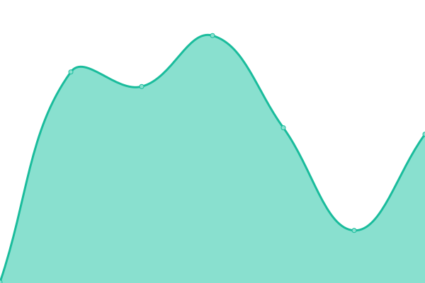

# [📈 Live Status](https://status.mobilityps.com): <!--live status--> **🟧 Partial outage**

This repository contains the open-source uptime monitor and status page for [MobilityPS-AR](https://status.mobilityps.com), powered by [Upptime](https://github.com/upptime/upptime).

With [Upptime](https://upptime.js.org), you can get your own unlimited and free uptime monitor and status page, powered entirely by a GitHub repository. We use [Issues](https://github.com/MobilityPS-AR/upptime/issues) as incident reports, [Actions](https://github.com/MobilityPS-AR/upptime/actions) as uptime monitors, and [Pages](https://status.mobilityps.com) for the status page.

<!--start: status pages-->
<!-- This summary is generated by Upptime (https://github.com/upptime/upptime) -->
<!-- Do not edit this manually, your changes will be overwritten -->
<!-- prettier-ignore -->
| URL | Status | History | Response Time | Uptime |
| --- | ------ | ------- | ------------- | ------ |
|  Brokers API | 🟩 Up | [brokers-api.yml](https://github.com/MobilityPS-AR/upptime/commits/HEAD/history/brokers-api.yml) | 

 183ms
     
 | 

<a href="https://status.mobilityps.com/history/brokers-api">100.00%</a>
    

|  System (main site) | 🟩 Up | [system-main-site.yml](https://github.com/MobilityPS-AR/upptime/commits/HEAD/history/system-main-site.yml) | 

 1051ms
     
 | 

<a href="https://status.mobilityps.com/history/system-main-site">100.00%</a>
    

|  API (v1) | 🟥 Down | [api-v1.yml](https://github.com/MobilityPS-AR/upptime/commits/HEAD/history/api-v1.yml) | 

 0ms
     
 | 

<a href="https://status.mobilityps.com/history/api-v1">100.00%</a>
    

|  Alternative API (v2) | 🟥 Down | [alternative-api-v2.yml](https://github.com/MobilityPS-AR/upptime/commits/HEAD/history/alternative-api-v2.yml) | 

 1602ms
     
 | 

<a href="https://status.mobilityps.com/history/alternative-api-v2">100.00%</a>
    

|  Main public provider | 🟩 Up | [main-public-provider.yml](https://github.com/MobilityPS-AR/upptime/commits/HEAD/history/main-public-provider.yml) | 

 747ms
     
 | 

<a href="https://status.mobilityps.com/history/main-public-provider">100.00%</a>
    

|  Secondary public provider | 🟩 Up | [secondary-public-provider.yml](https://github.com/MobilityPS-AR/upptime/commits/HEAD/history/secondary-public-provider.yml) | 

 417ms
     
 | 

<a href="https://status.mobilityps.com/history/secondary-public-provider">100.00%</a>
    

|  Testing environment (system) | 🟥 Down | [testing-environment-system.yml](https://github.com/MobilityPS-AR/upptime/commits/HEAD/history/testing-environment-system.yml) | 

 0ms
     
 | 

<a href="https://status.mobilityps.com/history/testing-environment-system">100.00%</a>
    

|  Testing environment (API) | 🟩 Up | [testing-environment-api.yml](https://github.com/MobilityPS-AR/upptime/commits/HEAD/history/testing-environment-api.yml) | 

 984ms
     
 | 

<a href="https://status.mobilityps.com/history/testing-environment-api">100.00%</a>
    

<!--end: status pages-->

[**Visit our status website →**](https://status.mobilityps.com)

## 📄 License

- Powered by: [Upptime](https://github.com/upptime/upptime)
- Code: [MIT](./LICENSE) © [MobilityPS-AR](https://status.mobilityps.com)
- Data in the `./history` directory: [Open Database License](https://opendatacommons.org/licenses/odbl/1-0/)
